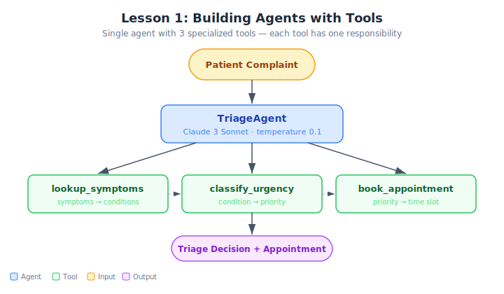

# Demo Solution: Healthcare Triage System

## Architecture



This folder contains the working solution for the Module 1 demo.

## File
- `healthcare_triage.py` — Complete implementation of a healthcare triage agent using Strands Agents SDK.

## What It Demonstrates
- Creating a BedrockModel with Claude 3 Sonnet
- Defining 3 tools with the @tool decorator (lookup_symptoms, classify_urgency, book_appointment)
- Writing a system prompt that enforces sequential tool calling
- Building an Agent that orchestrates the full triage pipeline

## How to Run
```bash
python healthcare_triage.py
```

## Expected Output
- Alice (chest pain) -> Urgent -> 9:00 AM Emergency
- Bob (headache) -> Routine -> 2:00 PM
- Carol (ankle) -> Standard -> 10:30 AM
