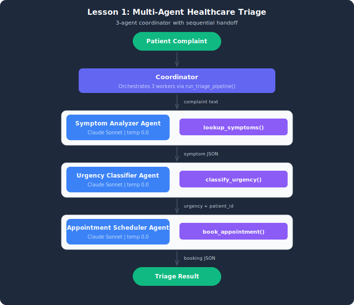

# Demo: Healthcare Triage System

## Architecture



This folder contains the working solution for the Module 1 demo.

## File
- `healthcare_triage.py` — Complete 3-agent healthcare triage system using Strands Agents SDK.

## What It Demonstrates
- Building 3 separate Agent instances, each with a single responsibility
- SymptomAnalyzer: maps complaint text to conditions using lookup_symptoms tool
- UrgencyClassifier: assigns priority level using classify_urgency tool
- AppointmentScheduler: books time slots using book_appointment tool
- Coordinator pattern: calling agents in sequence, passing outputs forward
- Fresh agent instantiation per test case to avoid context bleed

## Setup

1. Copy the env template: `cp .env.example .env`
2. Ensure AWS credentials are loaded (use the "Load AWS Credentials" sidebar in the Udacity lab).

## How to Run
```bash
python healthcare_triage.py
```

## Expected Output
- Alice (chest pain) -> Urgent -> 9:00 AM Emergency
- Bob (headache) -> Routine -> 2:00 PM
- Carol (ankle) -> Standard -> 10:30 AM
