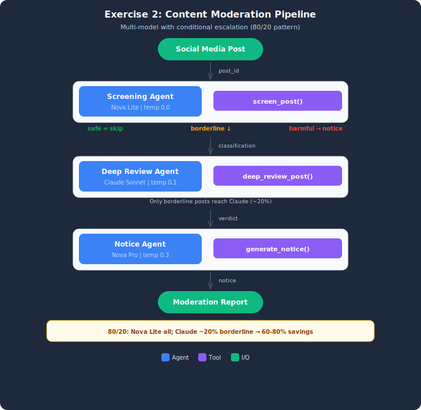

# Exercise Solution: Content Moderation Pipeline

## Architecture



This folder contains the working solution for the Module 2 exercise.

## File
- `content_moderation.py` — Complete implementation of a multi-model content moderation pipeline.

## What It Demonstrates
- Same multi-model pattern as demo, applied to content safety domain
- Conditional routing: only borderline posts escalate to Claude
- Fast-track path: safe posts skip Claude entirely (Nova Lite only)
- Latency comparison showing fast-track vs full pipeline speedup

## Setup

1. Copy the env template: `cp .env.example .env`
2. Ensure AWS credentials are loaded (use the "Load AWS Credentials" sidebar in the Udacity lab).

## How to Run
```bash
python content_moderation.py
```

## Expected Output
- POST-001 to POST-003 (safe) -> Fast-tracked, no Claude needed
- POST-004 to POST-006 (harmful) -> Screened + notice sent
- POST-007 to POST-009 (borderline) -> Escalated to Claude for deep review
- Moderation results table and latency comparison by path
