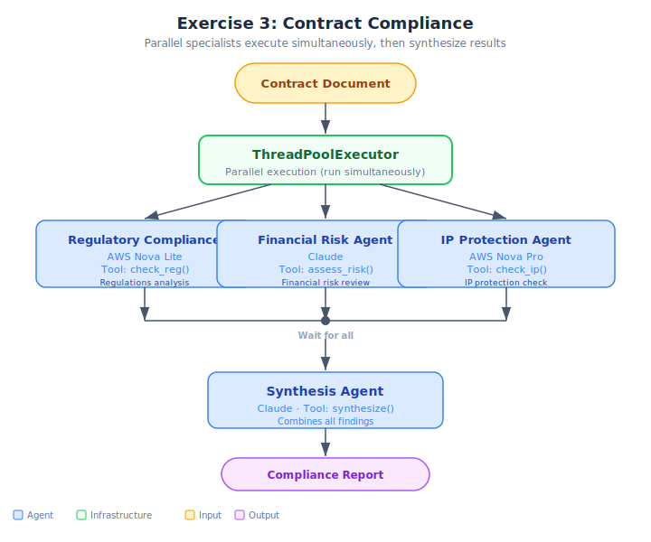

# Exercise: Parallel Contract Compliance — Solution

## Architecture



## File
- `contract_compliance.py` — Complete parallel contract compliance system

## What This Demonstrates
- **3 specialist agents** reviewing contracts from different legal perspectives in parallel
- **SynthesizerAgent** producing a unified compliance recommendation
- **Same specialist + synthesizer pattern** as the demo (document_analysis.py)
- **Two contrasting contracts**: clean vendor agreement vs. risky outsourcing deal

## Architecture
| Agent | Model | Role | Temperature |
|-------|-------|------|-------------|
| RegulatoryComplianceAgent | Nova Lite | GDPR, SOX, HIPAA checks | 0.0 |
| FinancialRiskAgent | Claude 3 Sonnet | Payment terms, liability, penalties | 0.1 |
| IPProtectionAgent | Nova Pro | IP ownership, licensing, non-compete | 0.1 |
| SynthesizerAgent | Claude 3 Sonnet | Combines findings → compliance decision | 0.2 |

## How to Run
```bash
python contract_compliance.py
```

## Expected Output
- 2 contracts analyzed:
  - CONTRACT-001 (vendor agreement): **APPROVE** — low risk across all dimensions
  - CONTRACT-002 (outsourcing): **REJECT** — HIGH risk in regulatory, financial, and IP
- Parallel vs sequential timing comparison with ~2-3x speedup
