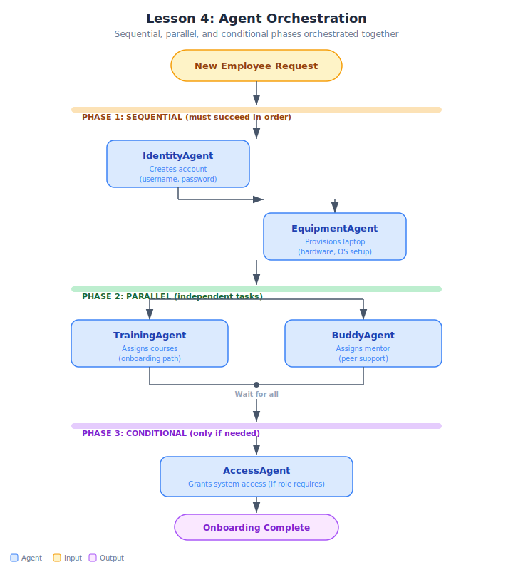

# Lesson 4: Implementing Agent Orchestration

This lesson teaches how to combine sequential, parallel, and conditional execution patterns into a single orchestrated workflow using a Python code orchestrator (not an LLM).

## Architecture



## Folder Structure

```
lesson-04-agent-orchestration/
├── README.md
├── demo-hr-onboarding/
│   └── solution/
│       ├── README.md
│       └── hr_onboarding.py
└── exercise-package-delivery/
    ├── solution/
    │   ├── README.md
    │   └── delivery_workflow.py
    └── starter/
        ├── README.md
        └── delivery_workflow.py
```

## Demo: HR Employee Onboarding Orchestration (Instructor-led)
- **Domain:** Human Resources
- **Architecture:** 6 worker agents managed by a Python code orchestrator
- **Phases:** Sequential (AccountCreator → ManagerAssigner) → Parallel (LaptopProvisioner + EmailSetup + BuildingAccess) → Conditional (EngineeringOnboarding OR SalesOnboarding)
- **Test cases:** EMP-001 (Engineering path), EMP-002 (Sales path), EMP-003 (Engineering + simulated laptop failure with retry)
- **Key insight:** The orchestrator is Python code, not an LLM — deterministic, debuggable, testable

## Exercise: Orchestrated Package Delivery Workflow (Student-led)
- **Domain:** Logistics / Package Delivery
- **Architecture:** 6 worker agents — AddressValidator (gate), LabelGenerator + InsuranceCalculator + CarrierSelector (parallel), DomesticShipping / InternationalShipping (conditional)
- **Test cases:** PKG-001 (domestic delivery → Domestic path), PKG-002 (international delivery → International path), PKG-003 (invalid address → workflow halts at gate)
- **Key insight:** Sequential GATE pattern — if validation fails, the entire workflow halts (vs demo's sequential chain where both steps always run)
