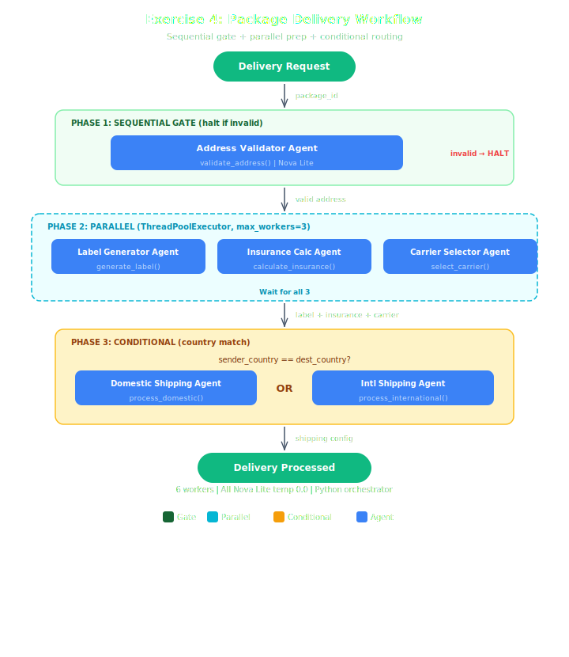

# Exercise Starter: Orchestrated Package Delivery Workflow

## Architecture



## Overview
This exercise is about **orchestration**, not agent wiring. The control plane — when agents run, how failures are handled, which branch is taken — is what you implement. Most of the agent boilerplate is already filled in so you can stay focused on the three orchestration primitives from the demo (hr_onboarding.py): sequential gate, parallel dispatch, and conditional routing.

## Your Task
Complete **9 TODOs** in `delivery_workflow.py`, split into two parts.

### Part A — Agent system prompts (TODOs 1–6)
For each of the 6 `build_*()` workers, the `BedrockModel` and `Agent(...)` construction are already written. You just fill in one thing per worker: the `system_prompt`. A good worker prompt is tight and single-purpose — tell the agent which tool to call and exactly what to report. If you're stuck, Module 1's SymptomAnalyzer prompt is a good reference.

### Part B — Orchestrator phases (TODOs 7–9)
Inside `orchestrate_delivery(...)`, implement the three control-flow phases:

| TODO | Phase | What you write |
|------|-------|----------------|
| 7 | Sequential GATE | Call the validator; if the result isn't valid, HALT and return early with `halted=True` |
| 8 | Parallel dispatch | Run label + insurance + carrier workers concurrently with `ThreadPoolExecutor(max_workers=3)`, record each timing, measure wall-clock for the phase |
| 9 | Conditional routing | Compare `pkg["sender_country"]` to `pkg["country"]` and dispatch to `build_domestic_shipping` or `build_international_shipping` |

Pattern references:
- The parallel dispatch primitive is the same one used in the Module 3 demo (`document_analysis.py`).
- The full 3-phase flow mirrors the Module 4 demo (`hr_onboarding.py`).
- `run_agent_with_retry(builder, prompt)` is already provided and returns elapsed seconds — use it for every agent invocation.
- Workers write their output into the shared `workflow_state` dict. Read from there to check a worker's result (e.g., `workflow_state["validation"]`).

## What's Already Done
- All 6 `@tool` functions (validate_address, generate_label, calculate_insurance, select_carrier, process_domestic, process_international)
- All 6 `BedrockModel` + `Agent(...)` constructions (you only write the prompts)
- The main() function with test execution and summary table
- Helper functions (clean_response, run_agent_with_retry)
- Sample data (DELIVERIES, CARRIER_RATES, INSURANCE_RATES)

## Architecture (same 3-pattern approach as demo)
1. **Phase 1 — Sequential Gate:** AddressValidator must return 'valid' before continuing
2. **Phase 2 — Parallel:** LabelGenerator + InsuranceCalculator + CarrierSelector run simultaneously
3. **Phase 3 — Conditional:** Route to DomesticShipping or InternationalShipping based on country

## Expected Results
| Package | Route | Notes |
|---------|-------|-------|
| PKG-001 | Domestic | US → US, USPS Priority, basic insurance |
| PKG-002 | International | US → DE, DHL International, premium insurance + customs |
| PKG-003 | HALTED | Empty address → gate stops workflow |

## Running
```bash
python delivery_workflow.py
```
