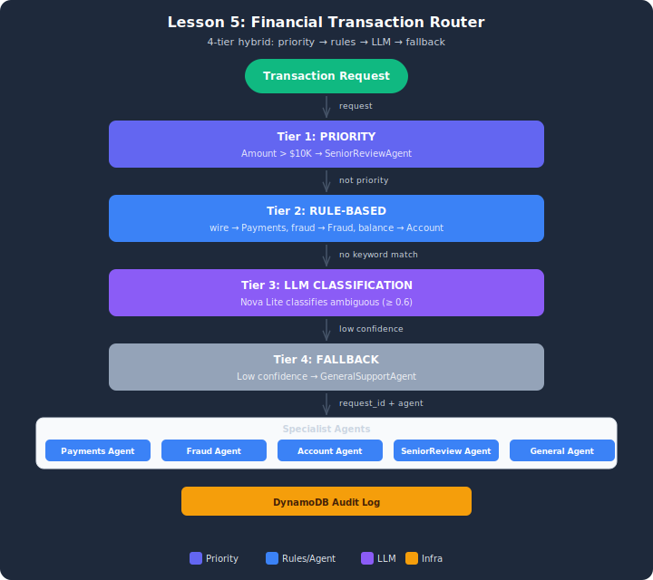

# Demo: Hybrid Router for Financial Transaction Processing

## Architecture



## Overview
This demo builds a hybrid routing system that combines four routing strategies: priority routing for high-value transactions, rule-based routing for known patterns, LLM-powered classification for ambiguous requests, and fallback routing when confidence is low.

## Setup

1. Copy the env template and load AWS credentials from the "Load AWS Credentials" sidebar:
   ```bash
   cp .env.example .env
   ```
2. Deploy the DynamoDB routing-audit table:
   ```bash
   aws cloudformation deploy --template-file infrastructure/stack.yaml \
       --stack-name lesson-05-demo-routing
   ```

## Architecture
- **Priority routing:** Transactions > $10,000 → SeniorReviewAgent (immediate override)
- **Rule-based routing:** Keyword matching → PaymentsAgent / FraudAgent / AccountAgent
- **LLM classification:** Nova Lite classifies ambiguous requests with confidence scores
- **Fallback:** Confidence < 0.6 → GeneralSupportAgent (flagged for human review)
- **Audit log:** Every routing decision logged to DynamoDB (routing_audit table)

## Models
- All agents: Amazon Nova Lite (routing needs speed, not depth)

## Test Cases (10 requests)
| Requests | Expected Route | Method |
|----------|---------------|--------|
| TXN-001 to TXN-006 | PaymentsAgent / FraudAgent / AccountAgent | Rule-based |
| TXN-007, TXN-008 | SeniorReviewAgent | Priority (>$10K) |
| TXN-009 | LLM-classified agent | LLM |
| TXN-010 | GeneralSupportAgent | Fallback |

## Running
```bash
python financial_router.py
```

## Cleanup
```bash
aws cloudformation delete-stack --stack-name lesson-05-demo-routing
```

## Key Takeaways
1. **Rules first, LLM second** — saves 70-80% of classification API costs
2. **Priority is an override** — checked before all other strategies
3. **Confidence thresholds** — LLM classification below 0.6 triggers fallback
4. **Audit logging** — every decision logged for compliance and analytics
5. **Fallback is a safety net** — requests are never dropped, always routed somewhere
