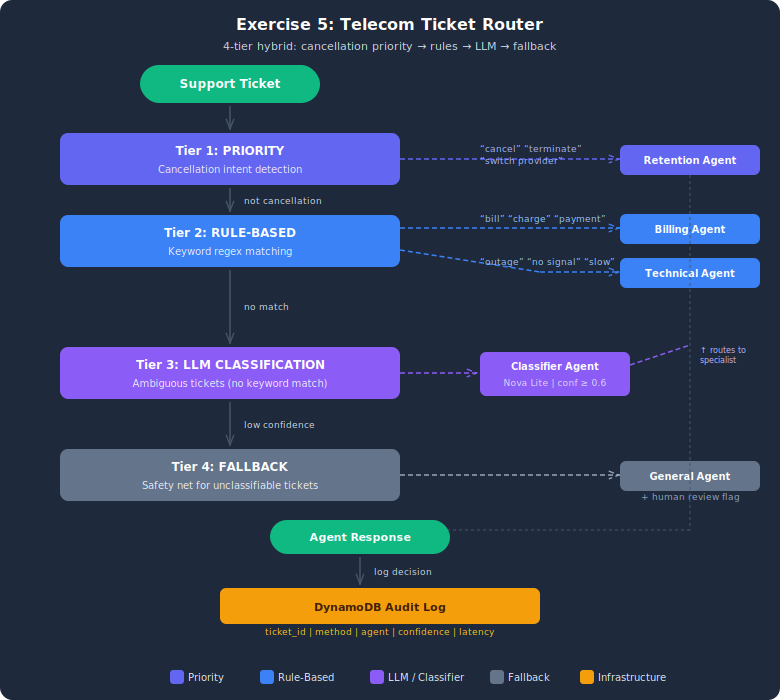

# Exercise Solution: Multi-Strategy Router for Telecom Customer Tickets

## Architecture



## Overview
This exercise builds a hybrid routing system for telecom customer support using the same four-strategy pattern from the demo, applied to a different domain with 20 tickets.

## Setup

1. Copy the env template:
   ```bash
   cp .env.example .env
   ```
2. If you already deployed the stack while doing the starter (`lesson-05-exercise-routing`), you don't need to deploy again — copy your starter `.env` values into this one. Otherwise:
   ```bash
   aws cloudformation deploy --template-file infrastructure/stack.yaml \
       --stack-name lesson-05-exercise-routing
   ```

## Architecture
- **Priority:** Cancellation intent → RetentionAgent (keyword detection)
- **Rule-based:** Billing keywords → BillingAgent, Technical keywords → TechnicalAgent
- **LLM classification:** Ambiguous tickets classified by Nova Lite
- **Fallback:** Low confidence → GeneralSupportAgent

## Test Cases (20 tickets)
| Category | Count | Pct | Method | Target |
|----------|-------|-----|--------|--------|
| Billing | 8 | 40% | Rule | BillingAgent |
| Technical | 6 | 30% | Rule | TechnicalAgent |
| Cancellation | 2 | 10% | Priority | RetentionAgent |
| Ambiguous | 4 | 20% | LLM/Fallback | Varies |

## Running
```bash
python telecom_router.py
```

## Cleanup
```bash
aws cloudformation delete-stack --stack-name lesson-05-exercise-routing
```

## Key Differences from Demo
- **Priority trigger:** Cancellation intent (demo used transaction amount > $10K)
- **Scale:** 20 tickets (demo had 10) — routing effectiveness report at the end
- **Domain keywords:** Billing/technical telecom terms (demo used financial terms)
- **Retention pattern:** Priority routing for cancellations is a business-critical pattern in telecom
