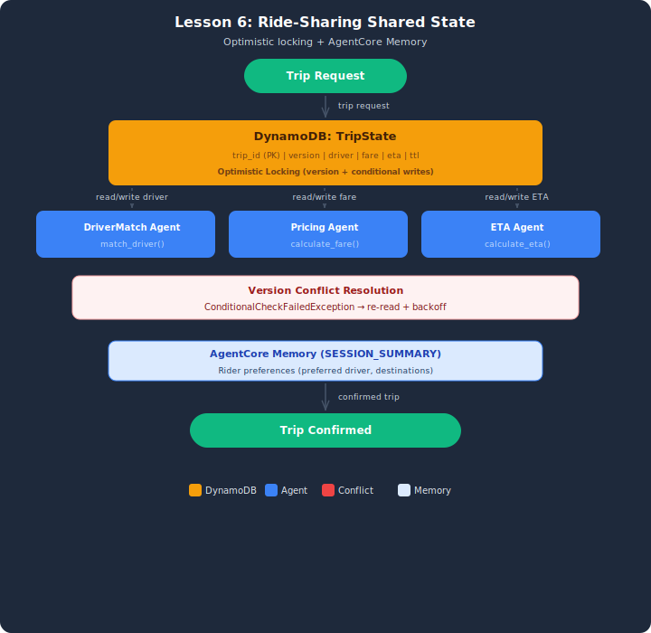

# Demo: Shared State for Ride-Sharing Trip Management

## Architecture



## Overview
This demo builds a shared state system where 3 worker agents update the same record for a ride-sharing trip. Optimistic locking (version-based conditional writes) prevents lost updates when agents run concurrently, and ConditionalCheckFailedException triggers automatic retry with exponential backoff. A simulated AgentCore Memory provides cross-session rider preference tracking.

## Setup

1. Copy the env template and load AWS credentials from the "Load AWS Credentials" sidebar:
   ```bash
   cp .env.example .env
   ```
2. Deploy the DynamoDB table:
   ```bash
   aws cloudformation deploy --template-file infrastructure/stack.yaml \
       --stack-name lesson-06-demo-shared-state
   ```

## Architecture
- **DynamoDB:** Real DynamoDB table with thread-safe conditional writes via boto3
- **Optimistic locking:** Each write checks `version == expected_version` — if another agent wrote first, ConditionalCheckFailedException is raised
- **3 worker agents:** DriverMatchAgent (writes driver), PricingAgent (writes fare), ETAAgent (writes ETA) — all update the SAME trip record
- **Cross-session memory:** rider_memory dict simulates AgentCore Memory SESSION_SUMMARY strategy — remembers preferred driver across trips

## Models
- All agents: Amazon Nova Lite (state operations need speed, not depth)

## AWS Services Used
- Amazon Bedrock (Nova Lite for agent inference)
- Amazon DynamoDB (real table for optimistic locking)
- Simulated AgentCore Memory (production-mapping comments show real bedrock-agentcore-control API)

## Test Cases (3 trips)
| Trip | Scenario | Key Behavior |
|------|----------|-------------|
| TRIP-001 | Sequential updates | Each agent runs one at a time — no conflicts |
| TRIP-002 | Concurrent updates | All 3 agents in parallel via ThreadPoolExecutor — version conflicts + retry |
| TRIP-003 | Cross-session memory | Same rider as TRIP-001 — preferred driver from memory |

## Running
```bash
python ride_sharing_state.py
```

## Cleanup
```bash
aws cloudformation delete-stack --stack-name lesson-06-demo-shared-state
```

## Key Takeaways
1. **Version-based conditional writes** — `version == expected_version` is the optimistic lock
2. **ConditionalCheckFailedException** — raised when another agent incremented version first
3. **Retry with backoff** — re-read record, get new version, try again (0.1s, 0.2s, 0.4s)
4. **TTL** — records auto-expire (1 hour) to prevent stale data accumulation
5. **DynamoDB vs AgentCore Memory** — DynamoDB for transactional state, AgentCore Memory for conversational context
6. **SESSION_SUMMARY strategy** — automatically extracts rider preferences across sessions
