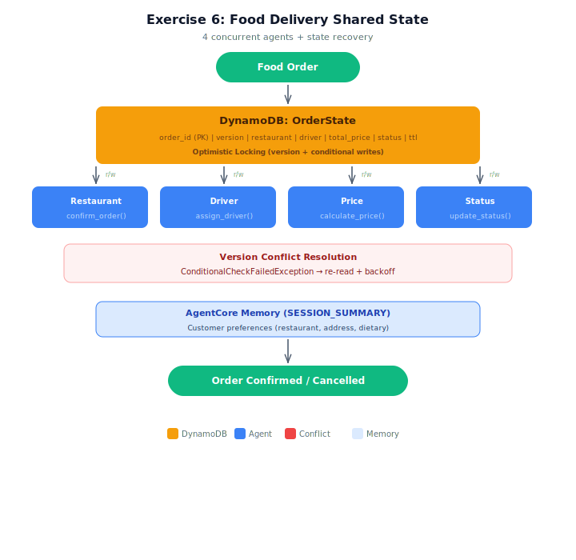

# Exercise Starter: Shared State for Food Delivery Orders

## Architecture



## Overview
Build a shared state system for food delivery orders following the same pattern from the demo (ride_sharing_state.py). Uses a real DynamoDB table for transactional state with optimistic locking, and a customer_memory dict for cross-session customer preferences (simulating AgentCore Memory SESSION_SUMMARY strategy).

## Setup

1. Copy the env template and load AWS credentials from the "Load AWS Credentials" sidebar:
   ```bash
   cp .env.example .env
   ```
2. Deploy the DynamoDB table:
   ```bash
   aws cloudformation deploy --template-file infrastructure/stack.yaml \
       --stack-name lesson-06-exercise-shared-state
   ```

## Your Task
Complete **18 TODOs** in `food_delivery_state.py`:

### State Management TODOs (4)
| TODO | What to implement | Hint |
|------|-------------------|------|
| TODO 1 | `create_order()` — put_item with version 0, TTL 2hrs | Same as demo's `create_trip()` but with order fields |
| TODO 2 | `update_order()` — conditional write + retry loop | Same as demo's `update_trip()` — KEY pattern |
| TODO 3 | `get_order()` — get_item from SimulatedDynamoDB | Same as demo's `get_trip()` |
| TODO 4 | `recover_order()` — NEW: cleanup after rejection | Reset driver/price to None, status="cancelled" |

### Worker Agent TODOs (12 = 3 per agent x 4 agents)
| Agent | TODOs | Tool provided |
|-------|-------|---------------|
| RestaurantConfirmAgent | 5, 6, 7 | confirm_order |
| DriverAssignAgent | 8, 9, 10 | assign_driver |
| PriceCalculatorAgent | 11, 12, 13 | calculate_price |
| StatusTrackerAgent | 14, 15, 16 | update_status |

Each agent follows STEP 1 → STEP 2 → STEP 3 (model → prompt → agent).

### Main Scenario TODOs (2)
| TODO | What to implement | Hint |
|------|-------------------|------|
| TODO 17 | Sequential scenario — run 4 agents one at a time | Same flow as demo's Scenario 1 |
| TODO 18 | Concurrent scenario — run 4 agents in parallel | ThreadPoolExecutor(max_workers=4) |

## What's Already Done
- DynamoDB table client (with optimistic locking helpers, ConditionalCheckFailedException handling, TTL)
- Customer memory dict (simulates AgentCore Memory SESSION_SUMMARY)
- All `@tool` functions for all 4 agents
- Scenario 3 (state recovery) — study how it uses recover_order()
- Helper functions (clean_response, run_agent_with_retry)

## Expected Results
- ORD-001: Sequential — all 4 agents complete, status "ready", no conflicts
- ORD-002: Concurrent — all 4 agents complete, version conflicts resolved via retry
- ORD-003: State recovery — driver + price written first, then restaurant rejects → recover_order() cleans up

## Running
```bash
python food_delivery_state.py
```

## Cleanup
```bash
aws cloudformation delete-stack --stack-name lesson-06-exercise-shared-state
```
