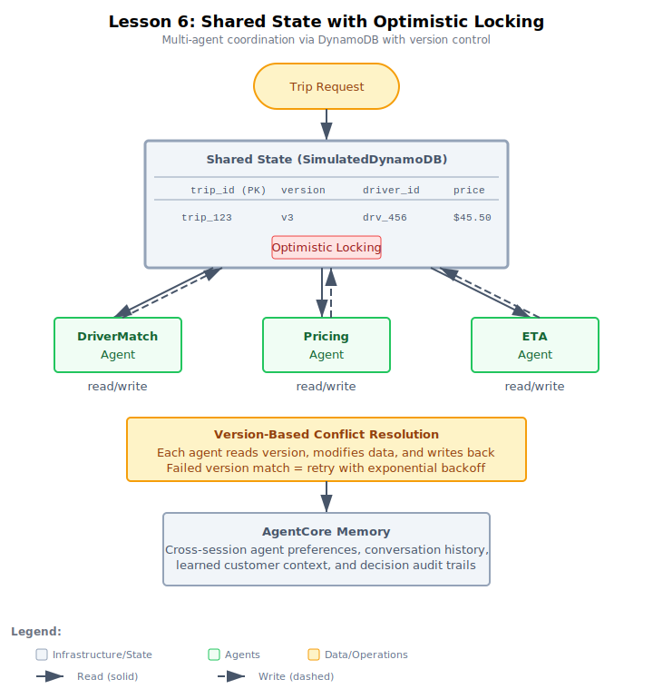

# Lesson 6: Implementing Shared State with DynamoDB and AgentCore Memory

This lesson teaches how to share mutable state across multiple agents using optimistic locking, and how to maintain cross-session conversational context using AgentCore Memory. When multiple agents update the same record concurrently, version-based conditional writes prevent lost updates, and ConditionalCheckFailedException triggers automatic retry.

The lesson uses in-memory simulations of DynamoDB and AgentCore Memory so students can focus on the patterns without infrastructure setup. Production-mapping comments throughout the code show the exact boto3 API calls used in the capstone project.

## Architecture



## Folder Structure

```
lesson-06-shared-state/
├── README.md
├── demo-ride-sharing/
│   └── solution/
│       ├── README.md
│       └── ride_sharing_state.py
└── exercise-food-delivery/
    ├── solution/
    │   ├── README.md
    │   └── food_delivery_state.py
    └── starter/
        ├── README.md
        └── food_delivery_state.py
```

## Demo: Shared State for Ride-Sharing Trip Management (Instructor-led)
- **Domain:** Ride-sharing (trip matching, pricing, ETA estimation)
- **Architecture:** 3 worker agents updating the SAME record via optimistic locking
- **Shared State:** SimulatedDynamoDB with version-based conditional writes, ConditionalCheckFailedException, TTL
- **Cross-Session Memory:** Simulated AgentCore Memory (rider_memory dict) with SESSION_SUMMARY strategy comments
- **Test cases:** 3 trips — sequential (no conflicts), concurrent (version conflicts + retry), cross-session memory (returning rider gets preferred driver)
- **Key insight:** DynamoDB handles transactional state (optimistic locking), AgentCore Memory handles conversational context (preferences) — two complementary services

## Exercise: Shared State for Food Delivery Orders (Student-led)
- **Domain:** Food delivery (restaurant confirmation, driver assignment, pricing, status tracking)
- **Architecture:** 4 worker agents (one more than demo) updating the SAME record, plus state recovery
- **Shared State:** Same optimistic locking pattern, with NEW state recovery for restaurant rejection
- **Cross-Session Memory:** Simulated AgentCore Memory (customer_memory dict) with SESSION_SUMMARY strategy comments
- **Test cases:** 3 orders — sequential, concurrent (4-way conflicts), state recovery (restaurant rejects → cleanup partial updates)
- **Key insight:** State recovery handles the case where some agents wrote partial data before a failure — cleanup resets fields and cancels the order
