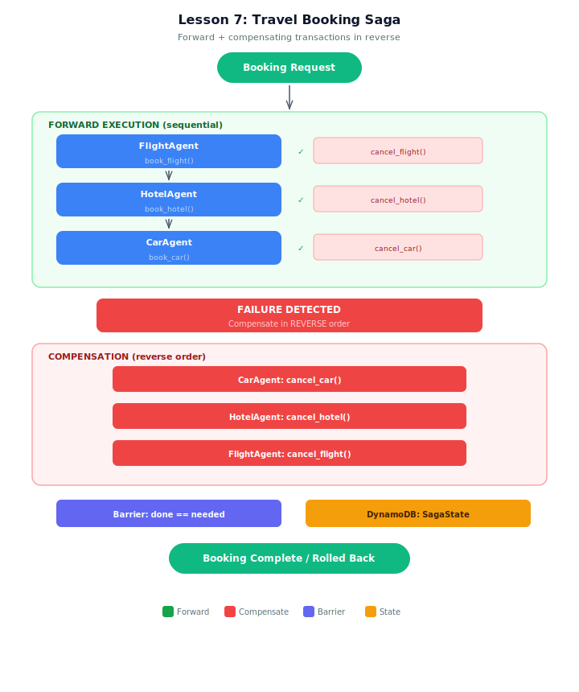

# Demo: Saga Pattern for Travel Booking

## Architecture



## Overview
This demo implements the Saga pattern for a travel booking system where a trip reservation spans three independent services: flight, hotel, and car rental. If any booking fails, the saga orchestrator runs compensating transactions to undo previous successful bookings in reverse order. A SimulatedDynamoDB state machine tracks the saga's progress through each phase.

## Architecture
- **3 booking agents:** FlightAgent (book/cancel flight), HotelAgent (book/cancel hotel), CarAgent (book/cancel car)
- **Saga orchestrator:** Python controller (NOT LLM-driven) that runs forward execution and compensation
- **State machine:** Tracks each step: pending → executing → completed/failed → compensating → compensated
- **Distributed lock:** Conditional write prevents concurrent compensation attempts

## Models
- All agents: Amazon Nova Lite (booking operations need speed, not depth)

## Test Cases (3 packages)
| Saga | Scenario | Key Behavior |
|------|----------|-------------|
| SAGA-001 | All succeed | Flight + Hotel + Car all confirmed |
| SAGA-002 | Car fails | Compensate Hotel, then Flight (reverse order) |
| SAGA-003 | Hotel fails | Compensate Flight only (car never started) |

## Running
```bash
python travel_booking_saga.py
```

## Key Takeaways
1. **Saga pattern** — sequence of local transactions, each with a compensating action
2. **Reverse order compensation** — last-completed step compensates first
3. **State machine** — tracks each step through its lifecycle
4. **Distributed lock** — conditional write prevents concurrent compensations
5. **Idempotent compensations** — safe to retry (cancel twice = same result)
6. **Crash recovery** — read state machine, resume from last recorded phase
