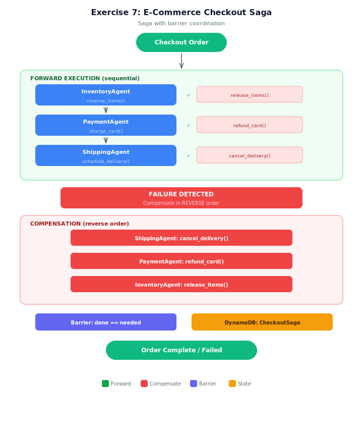

# Exercise Solution: Saga Pattern for E-Commerce Checkout

## Architecture



## Overview
This exercise implements a saga-based checkout flow where an order spans inventory reservation, payment processing, and shipping scheduling. Same saga pattern as the demo, with one addition: a barrier coordination primitive that ensures all compensations complete before the saga resolves.

## Architecture
- **3 checkout agents:** InventoryAgent (reserve/release items), PaymentAgent (charge/refund card), ShippingAgent (schedule/cancel delivery)
- **Saga orchestrator:** Python controller with forward execution + reverse-order compensation
- **Barrier (NEW):** Atomic counter that each compensation increments. Saga resolves to 'failed' only when counter equals steps to compensate.

## Test Cases (3 checkouts)
| Checkout | Scenario | Key Behavior |
|----------|----------|-------------|
| CHK-001 | All succeed | Inventory + Payment + Shipping all confirmed |
| CHK-002 | Payment fails | Release inventory (1 compensation, barrier: 1/1) |
| CHK-003 | Shipping fails | Refund payment + Release inventory (2 compensations, barrier: 2/2) |

## Setup

1. Copy the env template:
   ```bash
   cp .env.example .env
   ```
2. If you already deployed the stack while doing the starter (`lesson-07-exercise-saga`), you don't need to deploy again — copy your starter `.env` values into this one to point at the same resources. Otherwise:
   ```bash
   aws cloudformation deploy --template-file infrastructure/stack.yaml \
       --stack-name lesson-07-exercise-saga
   ```

## Running
```bash
python ecommerce_checkout_saga.py
```

## Cleanup
```bash
aws cloudformation delete-stack --stack-name lesson-07-exercise-saga
```

## Key Differences from Demo
- **Barrier coordination** — NEW: atomic counter ensures saga doesn't resolve prematurely
- **E-commerce domain** — inventory, payment, shipping instead of flight, hotel, car
- **Financial refunds** — payment compensation involves actual refund tracking
