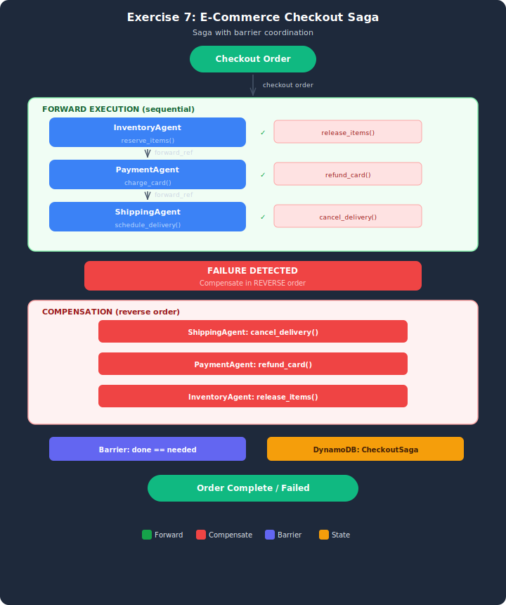

# Exercise Starter: Saga Pattern for E-Commerce Checkout

## Architecture



## Overview
Build a saga-based checkout flow following the same pattern from the demo (travel_booking_saga.py). Three checkout agents handle inventory, payment, and shipping — each with a forward action and a compensating action. Add a barrier coordination primitive that ensures all compensations complete before the saga resolves.

## Your Task
Complete **18 TODOs** in `ecommerce_checkout_saga.py`:

### State Machine TODOs (5)
| TODO | What to implement | Hint |
|------|-------------------|------|
| TODO 1 | `create_saga()` — initialize state machine + barrier fields | Same as demo, plus compensations_needed/completed counters |
| TODO 2 | `update_step()` — update a step in the saga | Same as demo |
| TODO 3 | `acquire_lock()` — distributed lock for compensation | Same as demo |
| TODO 4 | `release_lock()` — release lock after compensation | Same as demo |
| TODO 5 | `increment_barrier()` — NEW: atomic counter for barrier | Use DynamoDB ADD expression (same as demo's increment_barrier) |

### Agent Builder TODOs (9 = 3 per agent x 3 agents)
| Agent | TODOs | Tools provided |
|-------|-------|---------------|
| InventoryAgent | 6, 7, 8 | reserve_items, release_items |
| PaymentAgent | 9, 10, 11 | charge_card, refund_card |
| ShippingAgent | 12, 13, 14 | schedule_delivery, cancel_delivery |

Each agent needs: BedrockModel (TODO), system prompt for cancel mode (TODO), system prompt for forward mode (TODO). The @tool functions are provided.

### Orchestrator TODOs (4)
| TODO | What to implement | Hint |
|------|-------------------|------|
| TODO 15 | Forward execution — run agents sequentially | Same as demo |
| TODO 16 | Compensation with lock — reverse order | Same as demo, plus set barrier target |
| TODO 17 | Barrier check — verify all compensations done | NEW pattern |
| TODO 18 | Wire up main() to run all 3 scenarios | Same structure as demo |

## What's Already Done
- DynamoDB boto3 setup (real AWS resource — created by CloudFormation)
- All `@tool` functions for all 3 agents (forward + compensating)
- Sample checkout data (3 scenarios)
- agents_config setup in run_checkout_saga()
- Helper functions (clean_response, run_agent_with_retry)

## Setup

Before running, complete the setup in the parent `README.md`:
1. `.env` exists in `lesson-07-saga-pattern-and-state-coordination/` with your credentials, region, and model
2. The `lesson-07-saga` CloudFormation stack is deployed in your region

## Expected Results
- CHK-001: All succeed — status "completed"
- CHK-002: Payment fails → inventory released (barrier: 1/1)
- CHK-003: Shipping fails → payment refunded + inventory released (barrier: 2/2)

## Running
```bash
python ecommerce_checkout_saga.py
```
