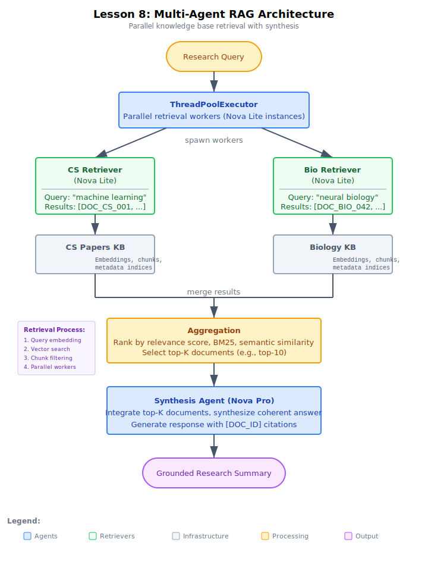

# Demo: Multi-Agent RAG for Research Assistant

## Architecture



## Overview
This demo implements a Multi-Agent RAG system where two specialized retriever agents each query a distinct Amazon Bedrock Knowledge Base (Computer Science papers and Biology papers). Both retrievers run in parallel using ThreadPoolExecutor. Their results are aggregated, ranked by relevance score, and passed to a synthesis agent that produces a grounded answer with citations.

## Setup

Bedrock Knowledge Bases require **us-west-2** (Oregon) or **us-east-1** (N. Virginia).

1. Copy the env template and load AWS credentials:
   ```bash
   cp .env.example .env
   ```
2. Deploy the S3 source bucket:
   ```bash
   aws cloudformation deploy --template-file infrastructure/stack.yaml \
       --stack-name lesson-08-demo-rag
   ```
3. Upload the CS and Biology documents to S3:
   ```bash
   python seed_documents.py
   ```
4. **Create the Knowledge Bases manually in the Bedrock console** (Knowledge Bases cannot be created via CloudFormation today). For each of CS Papers and Biology Papers:
   - Data source: **S3**, pointing at `s3://<bucket>/cs/` (or `/bio/`)
   - Embedding model: **amazon.titan-embed-text-v2:0**
   - Vector store: **Amazon S3 Vectors**
   - Click **Sync** on the data source after creation so the documents are ingested
5. Copy the two KB IDs into `CS_KB_ID` and `BIO_KB_ID` in your `.env`.

## Architecture
- **2 retriever agents:** CS Retriever (6 CS papers), Bio Retriever (6 Bio papers)
- **Parallel retrieval:** ThreadPoolExecutor dispatches both retrievers simultaneously
- **Result aggregation:** Combine results from both KBs, rank by score, select top-K
- **Synthesis agent:** Nova Pro produces a grounded summary citing [DOC_ID] for every claim

## Models
- Retrievers: Amazon Nova Lite (fast retrieval, temperature=0.0)
- Synthesis: Amazon Nova Pro (deeper reasoning, temperature=0.2)

## Test Cases (3 queries)
| Query | Scenario | Key Behavior |
|-------|----------|-------------|
| "neural networks protein folding" | Cross-domain | Hits both CS and Bio KBs |
| "transformer attention mechanisms NLP" | Domain-specific | Primarily CS KB |
| "quantum gravity dark matter" | Out-of-scope | Few/no relevant passages |

## Running
```bash
python research_assistant_rag.py
```

## Cleanup
Delete the two Knowledge Bases from the Bedrock console first (CloudFormation cannot delete them), then tear down the stack:
```bash
aws cloudformation delete-stack --stack-name lesson-08-demo-rag
```

## Key Takeaways
1. **Specialized retrievers** — each agent owns exactly one Knowledge Base
2. **Parallel retrieval** — ThreadPoolExecutor searches all KBs simultaneously
3. **Relevance scoring** — keyword-based scoring simulates vector similarity search
4. **Result aggregation** — combine + rank + top-K selection across KBs
5. **Grounded synthesis** — every factual claim cites a specific [DOC_ID]
6. **Graceful handling** — out-of-scope queries return minimal results, synthesis acknowledges gaps
