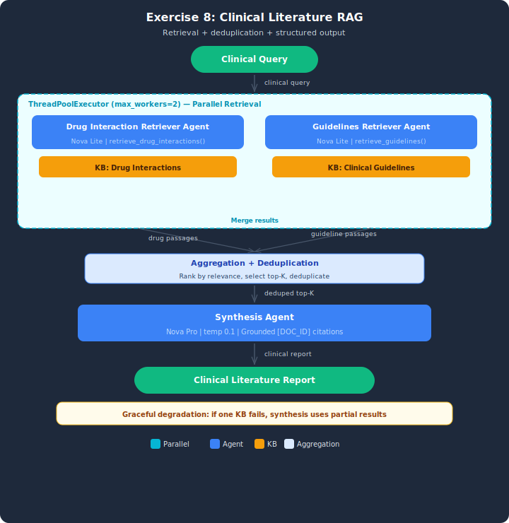

# Exercise Solution: Multi-Agent RAG for Clinical Literature

## Architecture



## Overview
This exercise implements a clinical decision support RAG system with two specialized retrievers (Drug Interactions and Clinical Guidelines). Same parallel retrieval pattern as the demo, with three additions: passage deduplication, structured clinical output, and graceful degradation when a Knowledge Base is unavailable.

## Architecture
- **2 retriever agents:** Drug Interaction Retriever (6 pharmaceutical docs), Clinical Guidelines Retriever (6 guideline docs)
- **Parallel retrieval:** ThreadPoolExecutor dispatches both retrievers simultaneously
- **Deduplication (NEW):** Remove near-identical passages before ranking
- **Structured output (NEW):** Drug Interactions + Clinical Guidelines + Integrated Recommendation
- **Graceful degradation (NEW):** When one KB fails, synthesis uses partial results with confidence disclaimer

## Test Cases (3 queries)
| Query | Scenario | Key Behavior |
|-------|----------|-------------|
| "warfarin drug interactions and anticoagulation guidelines" | Straightforward | Hits both Drug Interactions and Guidelines KBs |
| "SSRI MAOI interaction serotonin syndrome..." | Complex multi-drug | Spans both KBs with high relevance |
| "metformin diabetes renal..." | Degradation test | Drug Interactions KB fails — partial results only |

## Running
```bash
python clinical_literature_rag.py
```

## Key Differences from Demo
- **Deduplication** — NEW: removes duplicate passages across KBs before ranking
- **Structured output** — NEW: three-section clinical format instead of free-form summary
- **Graceful degradation** — NEW: explicit KB failure test with confidence disclaimer
- **Clinical domain** — drug interactions and guidelines instead of academic papers
