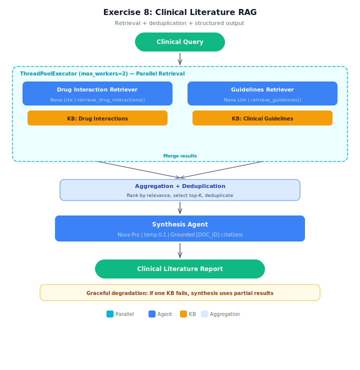

# Exercise Starter: Multi-Agent RAG for Clinical Literature

## Architecture



## Overview
Build a clinical literature RAG system following the same pattern from the demo (research_assistant_rag.py). Two specialized retrievers query real Amazon Bedrock Knowledge Bases (Drug Interactions and Clinical Guidelines) in parallel. Add deduplication, structured clinical output, and graceful degradation when a KB is unavailable.

## Setup

Bedrock Knowledge Bases require **us-west-2** (Oregon) or **us-east-1** (N. Virginia).

1. Copy the env template and load AWS credentials:
   ```bash
   cp .env.example .env
   ```
2. Deploy the S3 source bucket:
   ```bash
   aws cloudformation deploy --template-file infrastructure/stack.yaml \
       --stack-name lesson-08-exercise-rag
   ```
3. Upload the Drug Interactions and Clinical Guidelines documents to S3:
   ```bash
   python seed_documents.py
   ```
4. **Create the Knowledge Bases manually in the Bedrock console** (Knowledge Bases cannot be created via CloudFormation today). For each of Drug Interactions and Clinical Guidelines:
   - Data source: **S3**, pointing at `s3://<bucket>/drugs/` (or `/guidelines/`)
   - Embedding model: **amazon.titan-embed-text-v2:0**
   - Vector store: **Amazon S3 Vectors**
   - Click **Sync** on the data source after creation so the documents are ingested
5. Copy the two KB IDs into `DRUG_INTERACTIONS_KB_ID` and `CLINICAL_GUIDELINES_KB_ID` in your `.env`.

## Your Task
Complete **16 TODOs** in `clinical_literature_rag.py`:

### Retriever Agent TODOs (6 = 3 per retriever x 2 retrievers)
| Agent | TODOs | What to implement |
|-------|-------|-------------------|
| DrugInteractionRetriever | 1, 2, 3 | BedrockModel, system prompt, return Agent |
| GuidelinesRetriever | 4, 5, 6 | BedrockModel, system prompt, return Agent |

Each retriever needs: BedrockModel (TODO), system prompt (TODO), return Agent (TODO). The @tool functions are provided.

### Aggregation TODOs (2) — NEW pattern
| TODO | What to implement | Hint |
|------|-------------------|------|
| TODO 7 | `deduplicate_passages()` — remove duplicate doc_ids | Track seen IDs in a set |
| TODO 8 | `aggregate_results()` — combine + dedup + rank + top-K | Same as demo, plus dedup call |

### Synthesis Agent TODOs (5)
| TODO | What to implement | Hint |
|------|-------------------|------|
| TODO 9 | BedrockModel for synthesis | Use NOVA_PRO_MODEL, temperature=0.1 |
| TODO 10 | Format passages into string | Same as demo |
| TODO 11 | Partial notice for degradation | Conditional warning if partial=True |
| TODO 12 | System prompt for structured output | Drug Interactions + Guidelines + Recommendation sections |
| TODO 13 | Return Agent | Same as demo |

### Orchestrator TODOs (3)
| TODO | What to implement | Hint |
|------|-------------------|------|
| TODO 14 | Parallel retrieval with ThreadPoolExecutor | Same as demo |
| TODO 15 | Call aggregate_results | Combine drug + guideline passages |
| TODO 16 | Run synthesis agent | Same as demo, with partial flag |

## What's Already Done
- `retrieve_from_kb()` function that calls `bedrock-agent-runtime.retrieve()` against the Knowledge Base IDs you populate in `.env`
- All `@tool` functions for both retrievers
- Sample clinical queries (3 scenarios including degradation test)
- Helper functions (clean_response, run_agent_with_retry)
- Main function with output formatting

## Expected Results
- Query 1: Warfarin — hits both KBs, structured output with citations
- Query 2: SSRI/MAOI — high relevance across both KBs
- Query 3: Metformin (degradation) — Drug KB fails, partial results with disclaimer

## Running
```bash
python clinical_literature_rag.py
```

## Cleanup
Delete the two Knowledge Bases from the Bedrock console first (CloudFormation cannot delete them), then tear down the stack:
```bash
aws cloudformation delete-stack --stack-name lesson-08-exercise-rag
```
