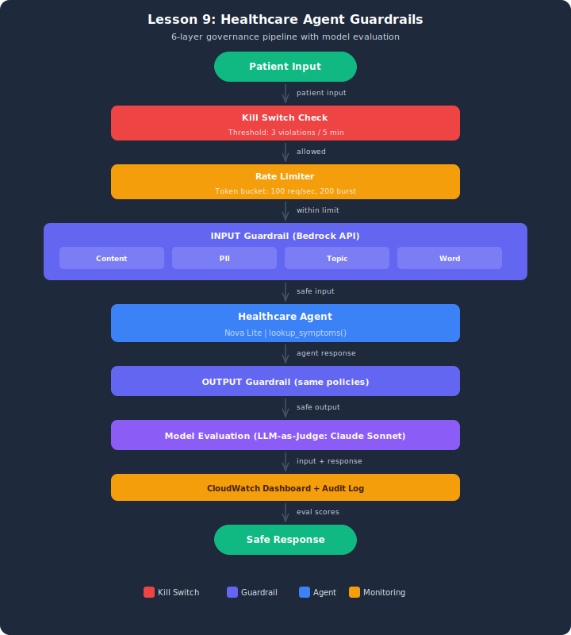

# Demo: Healthcare Agent Guardrails

## Architecture



## Overview
This demo implements production-grade governance for a healthcare patient intake agent. A real Amazon Bedrock Guardrail applies 4 policy types to every input and output via `bedrock-runtime.apply_guardrail()`. A kill switch monitors violation rates and disables the agent if thresholds are exceeded. A rate limiter prevents request floods. A metrics dashboard provides real-time visibility.

## Setup

1. Copy the env template and load AWS credentials:
   ```bash
   cp .env.example .env
   ```
2. Deploy the Bedrock Guardrail (region must be us-east-1):
   ```bash
   aws cloudformation deploy --template-file infrastructure/stack.yaml \
       --stack-name lesson-09-demo-guardrails
   ```
3. Copy `HealthcareGuardrailId` from the stack Outputs tab into `HEALTHCARE_GUARDRAIL_ID` in your `.env` (short ID, not the full ARN).

## Architecture
- **Healthcare agent:** Strands Agent (Nova Lite) that answers patient intake questions
- **Guardrail pipeline:** Rate limit check → Input guardrail → Agent → Output guardrail → Metrics + Kill switch
- **4 policy types:** Content filtering, PII protection, Topic denial, Word filtering
- **Kill switch:** Disables agent when violation rate exceeds threshold
- **Audit log:** Every guardrail decision is recorded for compliance

## Models
- Healthcare agent: Amazon Nova Lite (temperature=0.1)

## Test Cases (10 inputs)
| Input | Label | Expected | Policy |
|-------|-------|----------|--------|
| Headache report | Legitimate | ALLOWED | — |
| Pediatric fever | Legitimate | ALLOWED | — |
| Chest pain triage | Legitimate | ALLOWED | — |
| Annual physical | Legitimate | ALLOWED | — |
| Back pain | Legitimate | ALLOWED | — |
| SSN injection | Adversarial | BLOCKED | PII |
| Self-harm content | Adversarial | BLOCKED | CONTENT |
| Legal advice request | Adversarial | BLOCKED | TOPIC |
| Prescription request | Adversarial | BLOCKED | TOPIC |
| Profanity | Adversarial | BLOCKED | WORD |

## Running
```bash
python healthcare_guardrails.py
```

## Cleanup
```bash
aws cloudformation delete-stack --stack-name lesson-09-demo-guardrails
```

## Key Takeaways
1. **Layered defense** — guardrails + kill switch + rate limiting + monitoring
2. **4 policy types** — content, PII, topic, word (maps to Bedrock Guardrails API)
3. **PII block vs anonymize** — SSN blocked, email/phone anonymized
4. **Kill switch** — automatic agent shutdown on violation spike
5. **Audit log** — every decision recorded for compliance reporting
