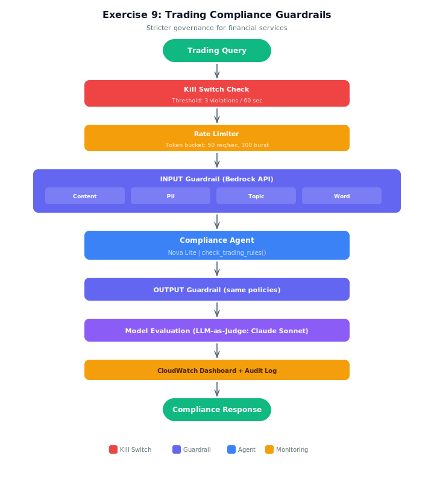

# Exercise Solution: Trading Compliance Guardrails

## Architecture



## Overview
This exercise implements the complete governance stack for a financial trading compliance agent. Same guardrail pattern as the demo (real Bedrock Guardrail via `bedrock-runtime.apply_guardrail()`), with additions: guardrail versioning (DRAFT → production), a stricter kill switch (3 violations in 60 seconds), and output guardrail scanning.

## Setup

1. Copy the env template:
   ```bash
   cp .env.example .env
   ```
2. If you already deployed the stack while doing the starter (`lesson-09-exercise-guardrails`), you don't need to deploy again — copy your starter `.env` values into this one. Otherwise:
   ```bash
   aws cloudformation deploy --template-file infrastructure/stack.yaml \
       --stack-name lesson-09-exercise-guardrails
   ```
3. Copy `TradingGuardrailId` from the stack Outputs tab into `TRADING_GUARDRAIL_ID` in your `.env` (or reuse the value from your starter `.env`).

## Architecture
- **Compliance agent:** Strands Agent (Nova Lite) that answers regulatory questions
- **Guardrail versioning (NEW):** create_version() promotes from DRAFT to version "1"
- **Kill switch (stricter):** 3 violations in 60 seconds triggers agent shutdown
- **Output guardrail (NEW):** Scans agent responses for PII leaks

## Test Cases (15 inputs)
| Input | Label | Expected | Policy |
|-------|-------|----------|--------|
| 5 regulatory questions | Legitimate | ALLOWED | — |
| Credit card number | Adversarial | BLOCKED | PII |
| SSN | Adversarial | BLOCKED | PII |
| Account number | Adversarial | BLOCKED | PII |
| Trade recommendation | Adversarial | BLOCKED | TOPIC |
| Insider trading (x2) | Adversarial | BLOCKED | TOPIC |
| Competitor disparagement | Adversarial | BLOCKED | TOPIC |
| Profanity | Adversarial | BLOCKED | WORD |
| Harmful content | Adversarial | BLOCKED | CONTENT |
| Email/phone (anonymize) | Adversarial | ANONYMIZED | PII |

## Running
```bash
python trading_compliance.py
```

## Cleanup
```bash
aws cloudformation delete-stack --stack-name lesson-09-exercise-guardrails
```

## Key Differences from Demo
- **Guardrail versioning** — NEW: DRAFT → version 1 promotion
- **Stricter kill switch** — 3 violations/60s vs percentage-based in demo
- **Output guardrail** — NEW: scans agent responses, not just inputs
- **Financial domain** — trading regulations, PII includes credit cards and account numbers
- **More adversarial inputs** — 10 vs 5, testing all four policy types
