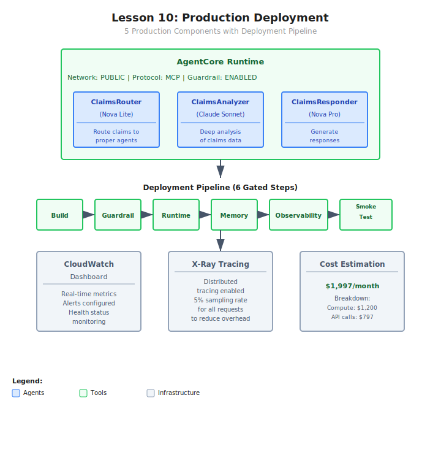

# Demo: Production Deployment Walkthrough

## Architecture



## Overview
This demo walks through the complete development-to-production transition for a multi-agent insurance claims processing system. It defines AgentCore Runtime configuration, a 6-step deployment pipeline, monitoring strategy, and cost estimates. No Bedrock calls are made — this is a planning and configuration exercise.

## What This Demo Covers
1. **Runtime config** — name, network mode (PUBLIC), protocol (MCP), guardrails, env vars
2. **Agent definitions** — 3 agents with different models and cost profiles
3. **Deployment pipeline** — 6 gated steps from build to smoke test
4. **Monitoring** — dashboard widgets, alarms, X-Ray tracing
5. **Cost estimation** — per-agent model costs + infrastructure

## Running
```bash
python deployment_walkthrough.py
```

## Key Takeaways
1. **Runtime is configuration** — AgentCore Runtime deploys config, not code packages
2. **Environment variables** — no hardcoded IDs; same code for dev/staging/prod
3. **Multi-model cost optimization** — Lite for routing, Sonnet for analysis
4. **Gated deployment** — each step has a pass/fail gate before proceeding
5. **Monitoring before launch** — dashboard and alarms set up before first production request
