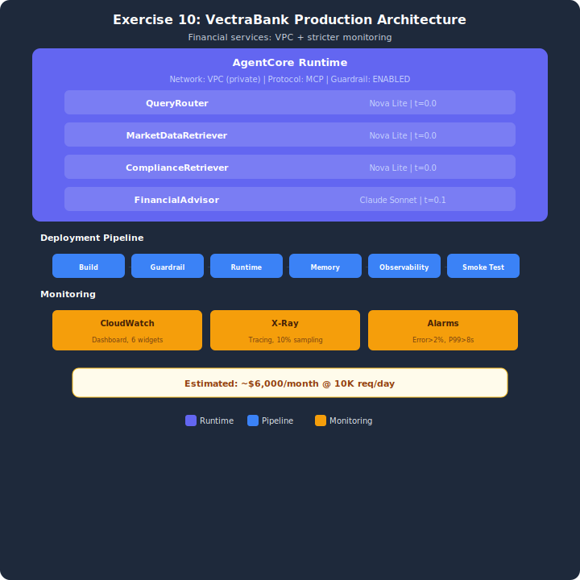

# Exercise Solution: VectraBank Deployment Architecture

## Architecture



## Overview
This exercise creates a production deployment plan for VectraBank's financial services multi-agent system. Same planning pattern as the demo, with additions: VPC network mode, operational runbooks, stricter compliance thresholds, and a 4-agent architecture preview.

## Setup

1. Copy the env template:
   ```bash
   cp .env.example .env
   ```
2. If you already deployed the stack while doing the starter (`lesson-10-exercise-runtime`), you don't need to deploy again — copy your starter `.env` values into this one. Otherwise:
   ```bash
   python infrastructure/deploy_stack.py
   ```

All resource identifiers are auto-discovered from CloudFormation exports via `_load_cf_exports()` — no manual paste needed (see the starter page for details).

## Architecture Plan
- **4 agents:** QueryRouter, MarketDataRetriever, ComplianceRetriever, FinancialAdvisor
- **3 Knowledge Bases:** Market Data, Compliance/Regulations, Financial Products
- **VPC network mode:** Financial services stay internal
- **Operational runbook (NEW):** 4 procedures for deploy, rollback, kill switch, latency

## Running
```bash
python vectrabank_architecture.py
```

## Cleanup
If you already tore down the stack after the starter, you're done. Otherwise:
```bash
aws cloudformation delete-stack --stack-name lesson-10-exercise-runtime
```

## Key Differences from Demo
- **VPC network mode** — financial services = internal only (vs PUBLIC in demo)
- **Operational runbook** — NEW: 4 step-by-step incident procedures
- **Stricter thresholds** — 2% error rate, 10% X-Ray sampling for audit
- **4 agents** — router + 2 retrievers + synthesizer (capstone preview)
