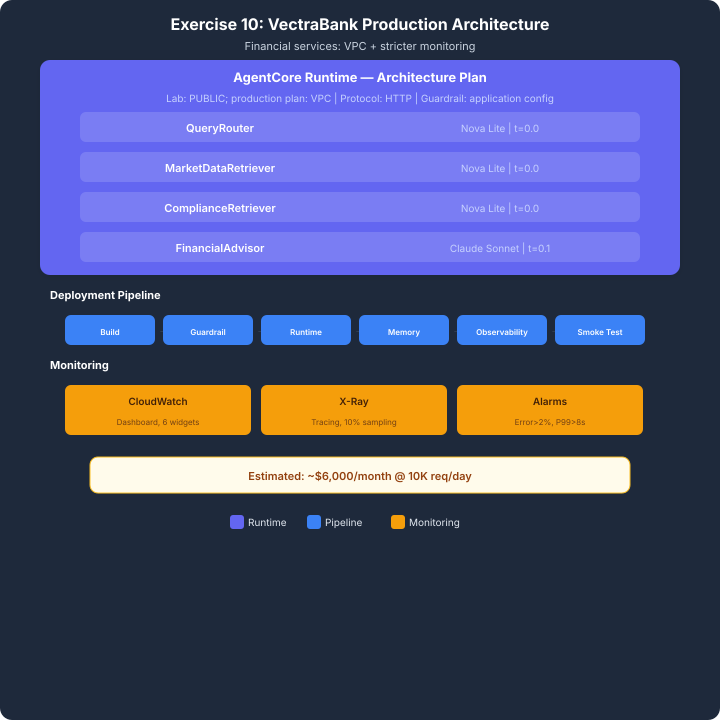

# Exercise Solution: VectraBank Deployment Architecture



This activity reviews runtime configuration, agent roles, monitoring and costs.
The Python script deploys through the provided `agentcore_cli.py` helper using
AgentCore CLI 0.30.0, already available in the classroom environment.

**Scope:** The deployed HTTP endpoint is a deployment smoke test. Agent definitions,
Knowledge Base IDs, dashboards, alarms and X-Ray sampling are architecture plans;
this activity does not execute the proposed multi-agent workflow or create those
monitoring resources. `runtime/main.py` makes no model calls. Guardrail identifiers
are supplied as runtime environment variables for future application model calls.

**Video note:** The video shows the earlier AWS SDK deployment workflow. Follow
these instructions and the updated workspace files for AgentCore CLI deployment.

## Setup

1. Copy `.env.example` to `.env` and paste the student AWS credentials from
   “Load AWS Credentials.” Check `AWS_REGION`.
2. Deploy the supporting execution role and guardrail:
   ```bash
   python infrastructure/deploy_stack.py
   ```

The helper reads the role and guardrail from the `lesson-10-exercise-runtime` stack.
The CLI manages the separate runtime stack and deployment asset storage.
When moving from starter to solution, reuse the supporting stack and remove the
starter runtime stack first. Run setup again only if the supporting stack is absent
or the infrastructure template changed.

## Run

Run from this activity directory:

```bash
python vectrabank_architecture.py
agentcore status
agentcore invoke '{"prompt":"deployment smoke test"}'
```

The expected invocation response says “Lesson 10 deployment smoke test passed”;
it does not validate model access or process a business request. The runtime uses
PUBLIC networking and HTTP. Real VPC deployment requires additional network resources.
Re-running the Python script updates the CLI configuration and existing runtime.
Never copy AWS credentials into the runtime configuration. The execution role
provides the runtime's AWS access.

## Cleanup

In the CloudFormation console, delete `AgentCore-lesson10solution-default` and wait for
completion. Then delete the supporting infrastructure when it is no longer needed
by either exercise folder:

```bash
aws cloudformation delete-stack --stack-name lesson-10-exercise-runtime
```

Do not delete a CLI-managed runtime individually in the AgentCore console.
The shared `CDKToolkit` bootstrap stack may be used by other activities; leave it in place.
For a different student account or region, start with a fresh copy of this activity.
