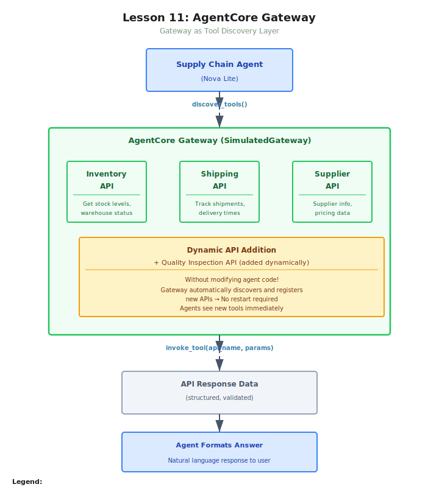

# Lesson 11: Implementing Inter-Agent Communication Using AgentCore Gateway

This lesson teaches the AgentCore Gateway pattern for decoupling agents from their tools. Instead of hardcoding tool integrations with @tool decorators, APIs are registered with Gateway and agents discover them through MCP at runtime. This trades some latency for flexibility: tools can be added, updated, or removed without touching agent code.

The lesson uses a simulated Gateway so students can focus on the architectural pattern without infrastructure setup. Production-mapping comments show the exact boto3 API calls for create_gateway and create_gateway_target.

## Architecture



## Folder Structure

```
lesson-11-agentcore-gateway/
├── README.md
├── demo-supply-chain-gateway/
│   └── solution/
│       ├── README.md
│       └── supply_chain_gateway.py
└── exercise-analytics-gateway/
    ├── solution/
    │   ├── README.md
    │   └── analytics_gateway.py
    └── starter/
        ├── README.md
        └── analytics_gateway.py
```

## Demo: Supply Chain Gateway (Instructor-led)
- **Domain:** Supply chain management (inventory, shipping, suppliers)
- **Gateway targets:** 3 REST APIs + 1 dynamically added Lambda
- **Key pattern:** Agent discovers tools at runtime via Gateway MCP endpoint
- **Dynamic addition:** Quality Inspection API added with zero agent code changes
- **Comparison:** Gateway vs @tool tradeoffs table

## Exercise: Analytics Gateway (Student-led)
- **Domain:** Data analytics utilities (weather, currency, news)
- **Mixed targets (NEW):** 2 Lambda functions + 1 REST API
- **Semantic routing:** Agent selects correct tool based on query semantics
- **Key insight:** Gateway enables a plugin architecture for agent tools
