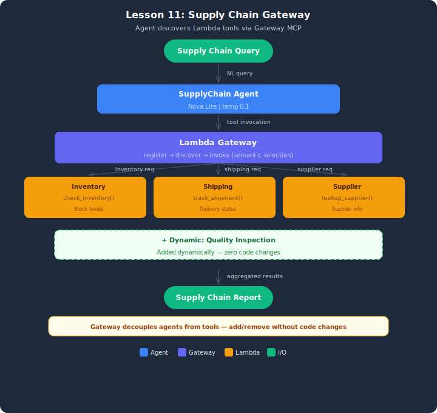

# Demo: Supply Chain Gateway

## Architecture



## Overview
This demo implements a supply chain agent connected to APIs through AgentCore Gateway. Three REST APIs are registered as Gateway targets, then a fourth (Quality Inspection) is added dynamically — without changing any agent code. The agent discovers all tools at runtime via the Gateway's MCP endpoint.

## Setup

1. Copy the env template and paste credentials from the "Load AWS Credentials" sidebar:
   ```bash
   cp .env.example .env
   ```
2. Deploy the Lambda backends and AgentCore Gateway role:
   ```bash
   python infrastructure/deploy_stack.py
   ```
3. Copy the printed `AGENTCORE_ROLE_ARN` value into your `.env`.

## Architecture
- **Gateway:** SimulatedGateway with tool registration and discovery
- **4 targets:** Inventory API, Shipping API, Supplier API, Quality Inspection (added dynamically)
- **Agent:** SupplyChainAgent discovers tools via Gateway and routes queries semantically

## Test Cases (4 queries)
| Query | Expected Tool | Description |
|-------|--------------|-------------|
| Check WIDGET-002 inventory | inventory_api | Inventory lookup |
| Status of SHIP-102 | shipping_api | Shipment tracking |
| List all suppliers | supplier_api | Supplier lookup |
| Quality inspection WIDGET-002 | quality_inspection_api | Dynamically added API |

## Running
```bash
python supply_chain_gateway.py
```

## Cleanup
```bash
aws cloudformation delete-stack --stack-name lesson-11-demo-gateway
```

If you created an AgentCore Gateway through the demo's live API calls, delete it from the Bedrock console: **Gateway → select → Delete**.

## Key Takeaways
1. **Gateway = plugin architecture** — register APIs, agents discover them
2. **Dynamic discovery** — new API added with zero agent code changes
3. **Semantic tool selection** — agent matches query to tool by description
4. **Gateway vs @tool** — loose coupling vs tight integration tradeoff
