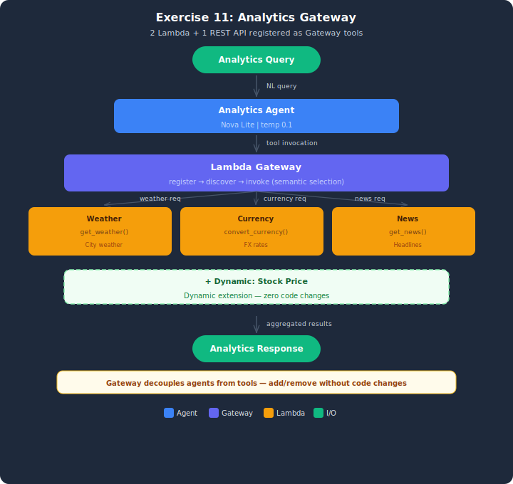

# Exercise Solution: Analytics Gateway

## Architecture



## Overview
This exercise implements an analytics agent connected to utility services through AgentCore Gateway. Same pattern as the demo with mixed target types: 2 Lambda functions and 1 REST API.

## Setup

1. Copy the env template:
   ```bash
   cp .env.example .env
   ```
2. If you already deployed the stack while doing the starter (`lesson-11-exercise-gateway`), you don't need to deploy again — copy your starter `.env` values into this one. Otherwise:
   ```bash
   python infrastructure/deploy_stack.py
   ```
3. Copy the printed `AGENTCORE_ROLE_ARN` value into your `.env` (or reuse from your starter `.env`).

## Architecture
- **Gateway:** SimulatedGateway with 3 registered targets
- **Targets:** Weather Lambda, Currency Lambda, News REST API
- **Agent:** AnalyticsAgent discovers and invokes tools via Gateway

## Test Cases (3 queries)
| Query | Expected Tool | Description |
|-------|--------------|-------------|
| Weather in Tokyo | weather_lambda | Routes to Weather Lambda |
| Convert 500 USD to EUR | currency_lambda | Routes to Currency Lambda |
| Latest AI news | news_api | Routes to News REST API |

## Running
```bash
python analytics_gateway.py
```

## Cleanup
```bash
aws cloudformation delete-stack --stack-name lesson-11-exercise-gateway
```

## Key Differences from Demo
- **Mixed targets** — 2 Lambda + 1 REST API (vs all REST in demo)
- **Analytics domain** — weather, currency, news instead of supply chain
- **Semantic routing focus** — agent must correctly match query to tool
